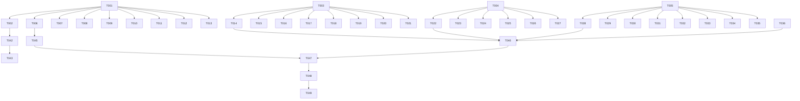

# Tasks: RouteDetailSheet 设计令牌统一

**Input**: Design documents from `spec/optimize-route-detail/`
**Prerequisites**: plan.md (required), spec.md (required for user stories)

**Organization**: Tasks are grouped by user story to enable independent implementation and testing of each story.

## Format: `[ID] [P?] [Story] Description`

- **[P]**: Can run in parallel (different files, no dependencies)
- **[Story]**: Which user story this task belongs to (e.g., US1, US2, US3)
- Include exact file paths in descriptions

## Phase 1: Setup (Shared Infrastructure)

**Purpose**: 补充颜色资源令牌定义，为后续所有用户故事提供基础设施

- [X] T001 在 features/home/src/main/resources/base/element/color.json 中新增所有缺失的颜色令牌定义（pace_bar_bg, pace_bar_start_fast, pace_bar_end_fast, pace_bar_start_normal, pace_bar_end_normal, pace_gradient_start, pace_gradient_mid, pace_gradient_end, pace_label_fast, pace_label_slow, insight_title, insight_text, insight_arrow, insight_gradient_start, insight_gradient_mid, insight_gradient_end, training_scale_1, training_scale_2, training_scale_3, training_scale_4, insight_heart_left, insight_heart_right, semantic_safe, chart_hr_zone5, chart_hr_zone4, chart_hr_zone3, chart_hr_zone2, chart_hr_zone1, chart_pace_high, chart_pace_medium, chart_pace_low, summary_text, collapse_text, collapse_arrow, shadow_elevated）
- [X] T002 在 features/home/src/main/resources/dark/element/color.json 中新增所有新增令牌的暗色模式色值

---

## Phase 2: Foundational (Blocking Prerequisites)

**Purpose**: 在 RouteDetailSheet.ets 中添加设计令牌常量组，为后续用户故事提供统一的常量引用

**⚠️ CRITICAL**: No user story work can begin until this phase is complete

- [X] T003 在 features/home/src/main/ets/view/RouteDetailSheet.ets 顶部添加字号常量组（FONT_HERO=48, FONT_DISPLAY=32, FONT_HEADLINE=24, FONT_TITLE=20, FONT_SUBTITLE=17, FONT_BODY=14, FONT_CAPTION=13, FONT_SMALL=12, FONT_TINY=11）
- [X] T004 [P] 在 features/home/src/main/ets/view/RouteDetailSheet.ets 顶部添加圆角常量组（RADIUS_SM=4, RADIUS_MD=8, RADIUS_LG=10, RADIUS_XL=12, RADIUS_XXL=16）
- [X] T005 [P] 在 features/home/src/main/ets/view/RouteDetailSheet.ets 顶部添加间距常量组（SPACE_XS=4, SPACE_SM=8, SPACE_MD=12, SPACE_LG=16, SPACE_XL=20, SPACE_XXL=24, SPACE_XXXL=32）

**Checkpoint**: Foundation ready - user story implementation can now begin in parallel

---

## Phase 3: User Story 1 - 颜色令牌统一 (Priority: P1) 🎯 MVP

**Goal**: 将 RouteDetailSheet 中所有硬编码颜色字符串替换为 $r() 资源引用

**Independent Test**: 切换暗色模式后所有颜色自动适配，全文搜索无 # 开头的硬编码颜色值

### Implementation for User Story 1

- [X] T006 [US1] 替换 buildOverviewCard 中的硬编码颜色：配速渐变条 #56D978→$r('app.color.pace_gradient_start'), #F7E94C→$r('app.color.pace_gradient_mid'), #FF9237→$r('app.color.pace_gradient_end'), 最快标签 #37C96C→$r('app.color.pace_label_fast'), 最慢标签 #E92323→$r('app.color.pace_label_slow') in features/home/src/main/ets/view/RouteDetailSheet.ets
- [X] T007 [US1] 替换 buildPaceBarsCard 中的硬编码颜色：配速条背景 #ECECEC→$r('app.color.pace_bar_bg'), 汇总文字 #555555→$r('app.color.summary_text'), 收起文字 #666666→$r('app.color.collapse_text'), 收起箭头 #9A9A9A→$r('app.color.collapse_arrow') in features/home/src/main/ets/view/RouteDetailSheet.ets
- [X] T008 [US1] 替换 buildPaceBarRow / getPaceBarStartColor / getPaceBarEndColor 中的硬编码颜色：#FF6B1F→$r('app.color.pace_bar_start_fast'), #FF4D13→$r('app.color.pace_bar_end_fast'), #F7A985→$r('app.color.pace_bar_start_normal')/$r('app.color.pace_bar_end_normal') in features/home/src/main/ets/view/RouteDetailSheet.ets
- [X] T009 [US1] 替换 buildSportInsightBox 中的硬编码颜色：标题 #FF816F→$r('app.color.insight_title'), 正文 #111111→$r('app.color.insight_text'), 箭头 #333333→$r('app.color.insight_arrow'), 渐变边框 #FFD35D→$r('app.color.insight_gradient_start'), #F08BCA→$r('app.color.insight_gradient_mid'), #57DCE4→$r('app.color.insight_gradient_end') in features/home/src/main/ets/view/RouteDetailSheet.ets
- [X] T010 [US1] 替换 buildInsightIcon 中的硬编码颜色：#FF765F→$r('app.color.insight_heart_left'), #7AA6FF→$r('app.color.insight_heart_right') in features/home/src/main/ets/view/RouteDetailSheet.ets
- [X] T011 [US1] 替换 buildTrainingPerformanceCard / buildColoredScale 中的硬编码颜色：#58D68D→$r('app.color.training_scale_1'), #F7DC6F→$r('app.color.training_scale_2'), #F5B041→$r('app.color.training_scale_3'), #E74C3C→$r('app.color.training_scale_4') in features/home/src/main/ets/view/RouteDetailSheet.ets
- [X] T012 [US1] 替换 drawLineChart 中的硬编码图表背景色 #EEEEEE→$r('app.color.neutral_divider')（需改为在调用处传入或使用常量） in features/home/src/main/ets/view/RouteDetailSheet.ets
- [X] T013 [US1] 替换 buildSplitTableCard 中剩余不足1公里行背景 #ECECEC→$r('app.color.pace_bar_bg') in features/home/src/main/ets/view/RouteDetailSheet.ets

**Checkpoint**: At this point, User Story 1 should be fully functional - all hardcoded colors replaced

---

## Phase 4: User Story 2 - 字号令牌对齐 (Priority: P1)

**Goal**: 将所有字号值严格对齐到设计令牌层级

**Independent Test**: 各模块字号严格匹配设计令牌定义，核心数据使用 hero/display

### Implementation for User Story 2

- [X] T014 [US2] 修改 buildOverviewCard 中的字号：距离数字 fontSize(40)→fontSize(48)（FONT_HERO）, 概览指标数值 fontSize(26)→fontSize(32)（FONT_DISPLAY）, 单位文字 fontSize(14) 保持, 统计时间 fontSize(12) 保持, 最快最慢标签 fontSize(10)→fontSize(11)（FONT_TINY） in features/home/src/main/ets/view/RouteDetailSheet.ets
- [X] T015 [US2] 修改 buildPaceBarsCard 中的字号：标题 fontSize(18)→fontSize(20)（FONT_TITLE）, 配速主值 fontSize(24) 保持（FONT_HEADLINE）, 单位/标签 fontSize(12) 保持, 汇总文字 fontSize(15)→fontSize(14)（FONT_BODY）, 公里/配速标题 fontSize(12) 保持 in features/home/src/main/ets/view/RouteDetailSheet.ets
- [X] T016 [US2] 修改 buildPaceBarRow 中的字号：公里数 fontSize(15)→fontSize(14)（FONT_BODY）, 配速值 fontSize(14) 保持 in features/home/src/main/ets/view/RouteDetailSheet.ets
- [X] T017 [US2] 修改 buildSplitTableCard 中的字号：标题 fontSize(16)→fontSize(20)（FONT_TITLE）, 列标题 fontSize(11)→fontSize(12)（FONT_SMALL）, 数据 fontSize(12) 保持 in features/home/src/main/ets/view/RouteDetailSheet.ets
- [X] T018 [US2] 修改 buildLineChartCard 中的字号：标题 fontSize(16)→fontSize(20)（FONT_TITLE）, 图表数值 fontSize(19)→fontSize(20)（FONT_TITLE）, 标签 fontSize(11) 保持, 图例 fontSize(10)→fontSize(11)（FONT_TINY）, 时间 fontSize(9)→fontSize(11)（FONT_TINY） in features/home/src/main/ets/view/RouteDetailSheet.ets
- [X] T019 [US2] 修改 buildSportInsightBox 中的字号：标题 fontSize(17) 保持（FONT_SUBTITLE）, 正文 fontSize(17)→fontSize(14)（FONT_BODY） in features/home/src/main/ets/view/RouteDetailSheet.ets
- [X] T020 [US2] 修改 buildTrainingPerformanceCard 中的字号：标题 fontSize(16)→fontSize(20)（FONT_TITLE）, 标签 fontSize(12) 保持, 数值 fontSize(18)→fontSize(20)（FONT_TITLE）, 描述 fontSize(10)→fontSize(11)（FONT_TINY） in features/home/src/main/ets/view/RouteDetailSheet.ets
- [X] T021 [US2] 修改 buildSheetHeader 中的字号：昵称 fontSize(17) 保持, 时间 fontSize(13) 保持, 拍立得日期 fontSize(8)→fontSize(11)（FONT_TINY） in features/home/src/main/ets/view/RouteDetailSheet.ets

**Checkpoint**: At this point, User Story 2 should be fully functional - all font sizes aligned to design tokens

---

## Phase 5: User Story 3 - 圆角令牌对齐 (Priority: P2)

**Goal**: 将所有圆角值严格映射到设计令牌

**Independent Test**: 所有圆角值均来自令牌体系，无非令牌值

### Implementation for User Story 3

- [X] T022 [US3] 修改 buildOverviewCard 中的圆角：borderRadius(26)→borderRadius(16)（RADIUS_XXL）, 配速渐变条 borderRadius(6)→borderRadius(8)（RADIUS_MD） in features/home/src/main/ets/view/RouteDetailSheet.ets
- [X] T023 [US3] 修改 buildPaceBarsCard 中的圆角：borderRadius(26)→borderRadius(16)（RADIUS_XXL）, 配速条 borderRadius(14)→borderRadius(12)（RADIUS_XL）, 不足1公里行 borderRadius(14)→borderRadius(12)（RADIUS_XL） in features/home/src/main/ets/view/RouteDetailSheet.ets
- [X] T024 [US3] 修改 buildSportInsightBox 中的圆角：外层 borderRadius(22)→borderRadius(16)（RADIUS_XXL）, 内层 borderRadius(21)→borderRadius(16)（RADIUS_XXL） in features/home/src/main/ets/view/RouteDetailSheet.ets
- [X] T025 [US3] 修改 buildSplitTableCard 中的圆角：borderRadius(16) 保持（RADIUS_XXL） in features/home/src/main/ets/view/RouteDetailSheet.ets
- [X] T026 [US3] 修改 buildLineChartCard 中的圆角：borderRadius(14)→borderRadius(12)（RADIUS_XL） in features/home/src/main/ets/view/RouteDetailSheet.ets
- [X] T027 [US3] 修改 buildTrainingPerformanceCard 中的圆角：borderRadius(14)→borderRadius(12)（RADIUS_XL）, 色块 borderRadius(3)→borderRadius(4)（RADIUS_SM）, 进度条 borderRadius(3)→borderRadius(4)（RADIUS_SM） in features/home/src/main/ets/view/RouteDetailSheet.ets

**Checkpoint**: At this point, User Story 3 should be fully functional - all border radii aligned to design tokens

---

## Phase 6: User Story 4 - 间距令牌对齐 (Priority: P2)

**Goal**: 将所有间距值映射到设计令牌体系

**Independent Test**: 所有间距值可映射到令牌体系，无任意中间值

### Implementation for User Story 4

- [X] T028 [US4] 修改 buildOverviewCard 中的间距：padding top:20 保持, right:18→16, bottom:20 保持, left:18→16; Column space:26→24; 概览指标 padding bottom:20→16 in features/home/src/main/ets/view/RouteDetailSheet.ets
- [X] T029 [US4] 修改 buildPaceBarsCard 中的间距：padding top:28→24, right:18→16, bottom:18→16, left:18→16; Column space:22→20 in features/home/src/main/ets/view/RouteDetailSheet.ets
- [X] T030 [US4] 修改 buildSportInsightBox 中的间距：padding top:16 保持, right:16 保持, bottom:18→16, left:16 保持; Column space:14→12 in features/home/src/main/ets/view/RouteDetailSheet.ets
- [X] T031 [US4] 修改 buildSplitTableCard 中的间距：padding 16 保持; Column space:10→12 in features/home/src/main/ets/view/RouteDetailSheet.ets
- [X] T032 [US4] 修改 buildLineChartCard 中的间距：padding left:14→16, right:14→16, top:14→16, bottom:12 保持; Column space:12 保持 in features/home/src/main/ets/view/RouteDetailSheet.ets
- [X] T033 [US4] 修改 buildTrainingPerformanceCard 中的间距：padding 16 保持; Column space:14→12 in features/home/src/main/ets/view/RouteDetailSheet.ets
- [X] T034 [US4] 修改 buildStatsCard 中的间距：Column space:10→12; margin top:20 保持 in features/home/src/main/ets/view/RouteDetailSheet.ets
- [X] T035 [US4] 修改 buildSheetHeader 中的间距：padding left:20 保持, right:20 保持 in features/home/src/main/ets/view/RouteDetailSheet.ets

**Checkpoint**: At this point, User Story 4 should be fully functional - all spacing aligned to design tokens

---

## Phase 7: User Story 5 - 字重令牌对齐 (Priority: P3)

**Goal**: 字重对齐到设计令牌：bold(700)/semibold(600)/medium(500)/regular(400)

**Independent Test**: 字重使用与设计令牌定义一致

### Implementation for User Story 5

- [X] T036 [US5] 修改 buildPaceBarsCard 标题字重：FontWeight.Bold→FontWeight.Medium（配速标题对应 semibold 场景） in features/home/src/main/ets/view/RouteDetailSheet.ets
- [X] T037 [US5] 修改 buildSplitTableCard 标题字重：FontWeight.Bold→FontWeight.Medium in features/home/src/main/ets/view/RouteDetailSheet.ets
- [X] T038 [US5] 修改 buildLineChartCard 标题字重：FontWeight.Bold→FontWeight.Medium in features/home/src/main/ets/view/RouteDetailSheet.ets
- [X] T039 [US5] 修改 buildTrainingPerformanceCard 标题字重：FontWeight.Bold→FontWeight.Medium in features/home/src/main/ets/view/RouteDetailSheet.ets
- [X] T040 [US5] 修改 buildSportInsightBox 标题字重：FontWeight.Bold→FontWeight.Medium in features/home/src/main/ets/view/RouteDetailSheet.ets
- [X] T041 [US5] 确认核心数值字重保持 FontWeight.Bold（距离、概览指标、配速主值） in features/home/src/main/ets/view/RouteDetailSheet.ets

**Checkpoint**: At this point, User Story 5 should be fully functional - all font weights aligned to design tokens

---

## Phase 8: User Story 6 - 暗色模式完善 (Priority: P2)

**Goal**: 补充所有新增令牌的暗色模式色值

**Independent Test**: 切换暗色模式后所有新增令牌颜色正确显示

### Implementation for User Story 6

- [X] T042 [US6] 验证 dark/element/color.json 中所有新增令牌均有暗色值定义，缺失的补充 in features/home/src/main/resources/dark/element/color.json
- [ ] T043 [US6] 在设备/模拟器上切换暗色模式，验证 RouteDetailSheet 所有颜色正确适配 in features/home/src/main/ets/view/RouteDetailSheet.ets

**Checkpoint**: At this point, User Story 6 should be fully functional - dark mode works correctly

---

## Phase 9: Polish & Cross-Cutting Concerns

**Purpose**: 跨用户故事的收尾优化

- [X] T044 清理 RouteDetailSheet.ets 中可能残留的未使用常量或冗余代码 in features/home/src/main/ets/view/RouteDetailSheet.ets
- [X] T045 全文搜索 RouteDetailSheet.ets 确认零硬编码颜色字符串（# 开头） in features/home/src/main/ets/view/RouteDetailSheet.ets
- [X] T046 确认字号/圆角/间距常量在代码中一致使用，无遗漏的直接数字值 in features/home/src/main/ets/view/RouteDetailSheet.ets

---

## Phase 10: Verification

<!-- verification_scope: build+ui -->

**Purpose**: Build, deploy, and UI-verify the implemented feature

- [ ] T047 Build project and fix any compilation errors (invoke build_project; iterate fix → build until success)
- [ ] T048 Deploy application to device/emulator (invoke start_app)
- [ ] T049 Run UI verification against deployed application (invoke verify_ui)

---

## 📊 Dependency Graph

## ⚡ Parallel Execution Guide

| Phase | Tasks | Required Files | Execution Notes |
|-------|-------|---------------|-----------------|
| Setup | T001, T002 | color.json (base+dark) | T001 先行，T002 可并行但依赖 T001 确定令牌名 |
| Foundational | T003, T004, T005 | RouteDetailSheet.ets | 三个常量组互不依赖，可并行添加 |
| US1 颜色 | T006-T013 | RouteDetailSheet.ets | 各 Builder 方法互不依赖，可并行修改 |
| US2 字号 | T014-T021 | RouteDetailSheet.ets | 各 Builder 方法互不依赖，可并行修改 |
| US3 圆角 | T022-T027 | RouteDetailSheet.ets | 各 Builder 方法互不依赖，可并行修改 |
| US4 间距 | T028-T035 | RouteDetailSheet.ets | 各 Builder 方法互不依赖，可并行修改 |
| US5 字重 | T036-T041 | RouteDetailSheet.ets | 各处修改互不依赖，可并行 |
| US6 暗色 | T042, T043 | color.json (dark) + RouteDetailSheet.ets | T042 先行，T043 验证 |
| Polish | T044-T046 | RouteDetailSheet.ets | 可并行 |
| Verification | T047-T049 | 全项目 | 严格顺序执行 |

---

## Implementation Strategy

### MVP First (User Story 1 Only)

1. Complete Phase 1: Setup (color.json 令牌定义)
2. Complete Phase 2: Foundational (常量组)
3. Complete Phase 3: User Story 1 (颜色令牌统一)
4. **STOP and VALIDATE**: 切换暗色模式验证颜色适配
5. Build and deploy

### Incremental Delivery

1. Setup + Foundational → 基础设施就绪
2. US1 颜色 → 验证 → 部署
3. US2 字号 → 验证 → 部署
4. US3 圆角 → 验证 → 部署
5. US4 间距 → 验证 → 部署
6. US5 字重 → 验证 → 部署
7. US6 暗色 → 验证 → 部署
8. Polish → 最终验证

---

## Summary

- **Total tasks**: 49
- **US1 (P1 颜色)**: 8 tasks (T006-T013)
- **US2 (P1 字号)**: 8 tasks (T014-T021)
- **US3 (P2 圆角)**: 6 tasks (T022-T027)
- **US4 (P2 间距)**: 8 tasks (T028-T035)
- **US5 (P3 字重)**: 6 tasks (T036-T041)
- **US6 (P2 暗色)**: 2 tasks (T042-T043)
- **Setup**: 2 tasks (T001-T002)
- **Foundational**: 3 tasks (T003-T005)
- **Polish**: 3 tasks (T044-T046)
- **Verification**: 3 tasks (T047-T049)
- **Parallel opportunities**: Foundational 常量组可并行；每个 US 内各 Builder 方法可并行
- **MVP scope**: US1 (颜色令牌统一) - 最基础且影响最大的改造
